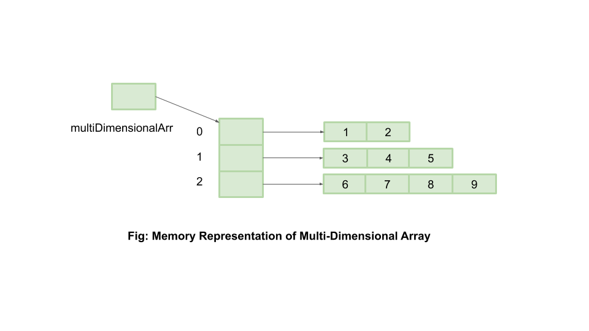

## Комментарии Java

`//` Однострочный

`/*  …                     */`  Многострочный

`/**  … */` Javadoc


## **Массивы Java**

Структура данных, которая позволяет хранить много элементов **одного типа** в одной переменной.  Для создания массива нужно указать тип элементов и количество ячеек:

`int[] numbers = new int[5];` - массив из 5 чисел. 

По умолчанию все элементы массива равняются нулю (для чисел).

`int[] numbers = {1, 2, 3, 4, 5};`

Массив **фиксированного размера**, то есть после создания нельзя изменить его длину

```java
int[] numbers = new int[3]; // создаем массив из трех элементов
numbers[0] = 10; // присваиваем первому элементу значение 10
numbers[1] = 20; // присваиваем второму элементу значение 20
numbers[2] = 30; // присваиваем третьему элементу значение 30

System.out.println(numbers[0]); // 10
System.out.println(numbers[1]); // 20
System.out.println(numbers[2]); // 30
```

```java
String[] names = {"Alice", "Bob", "Charlie"};
System.out.println(names[0]); // Alice
System.out.println(names[1]); // Bob
System.out.println(names[2]); // Charlie
```

### Доступ к элементам массива

```java
int[] numbers = {10, 20, 30, 40, 50};
int firstElement = numbers[0]; 
int lastElement = numbers[4];

System.out.println("Первый элемент: " + firstElement); // Первый элемент: 10
System.out.println("Последний элемент: " + lastElement); // Последний элемент: 50
```

Если попытаться обратиться к несуществующему индексу, например, `numbers[5]`, то возникнет исключение `ArrayIndexOutOfBoundsException`, так как элемент с индексом `5` не существует в массиве длиной `5`.

### Длинна масива

`int length = numbers.length;`


---

### Циклы с массивами

- `for`  - работать с **индексами** элементов массива. Он позволяет контролировать, с какого элемента начинать, когда заканчивать, и с каким шагом идти.

```java
int[] numbers = {10, 20, 30, 40, 50};

for (int i = 0; i < numbers.length; i++) {
    System.out.println("Элемент с индексом " + i + ": " + numbers[i]);
}
```

`int i = 0`: Мы начинаем с нулевого индекса (`i` — это индекс, который указывает на текущий элемент массива).

`i < numbers.length`: Цикл продолжается до тех пор, пока `i` меньше длины массива.

`i++`: После каждой итерации `i` увеличивается на единицу, чтобы перейти к следующему элементу массива.

Вывод:

```java
/* Элемент с индексом 0: 10
Элемент с индексом 1: 20
Элемент с индексом 2: 30
*/
........
```

Применение цикла `for`:

- Поиск максимального или минимального элемента в массиве.
- Модификация каждого элемента (например, увеличение всех значений в массиве на определенное число)


---


- `for-each` - 
позволяет только **читать** каждый элемент, но не дает возможности напрямую изменить его местоположение (индекс) в массиве. Цикл `for-each` позволяет обходить все элементы массива **без явного использования индексов**.

```java
int[] numbers = {10, 20, 30, 40, 50};

// Проходимся по всем элементам массива с помощью цикла for-each
for (int number : numbers) {
    System.out.println("Элемент: " + number);
}

// number - переменная, на каждой итерации принимает значение numbers
```

Применение цикла `for-each`:

- Простая итерация по элементам, когда не нужно знать индексы.
- Вывод элементов массива на экран.
- Суммирование всех элементов массива.

**Нахождение суммы элементов в массиве:**

```java
int[] numbers = {5, 10, 15, 20, 25};
int sum = 0;

// Используем цикл for для суммирования всех элементов массива
for (int i = 0; i < numbers.length; i++) {
    sum += numbers[i];
}

System.out.println("Сумма элементов массива: " + sum);
```


---


### Двумерные массивы



Многомерные массивы позволяют создавать **массивы, которые содержат в себе другие массивы**, что полезно для хранения более сложных структур данных, таких как матрицы или таблицы. 
Многомерный массив — это массив массивов. В Java чаще всего используются **двумерные массивы**, но возможно создание массивов с большим количеством измерений (трехмерные, четырехмерные и т.д.).

`int[][] matrix;`

Для создания массива с фиксированным числом строк и столбцов используется `new`:

`int[][] matrix = new int[3][4];`     `[строка][столбец]`
По умолчанию все элементы будут равны `0`.

```java
int[][] matrix = new int[2][3]; // Двумерный массив с 2 строками и 3 столбцами
matrix[0][0] = 1;
matrix[0][1] = 2;
matrix[0][2] = 3;
matrix[1][0] = 4;
matrix[1][1] = 5;
matrix[1][2] = 6;
```

| 1 | 2 | 3 |
| --- | --- | --- |
| 4 | 5 | 6 |

Можно сразу же задать значения при создании массива:

```java
int[][] matrix = {
    {1, 2, 3},
    {4, 5, 6},
    {7, 8, 9}
};

int value = matrix[1][2]; // Получаем элемент из 2 строки и 3 столбца (6)
System.out.println("Значение: " + value); // Значение: 6
```

Итерация по всем элементам массива

```java
int[][] matrix = {
    {1, 2, 3},
    {4, 5, 6},
    {7, 8, 9}
};

// Проходимся по строкам
for (int i = 0; i < matrix.length; i++) {
    // Проходимся по столбцам
    for (int j = 0; j < matrix[i].length; j++) {
        System.out.print(matrix[i][j] + " ");
    }
    System.out.println(); // Переход на новую строку после каждой строки
}

/*
1 2 3
4 5 6
7 8 9
*/
```

Стек - спеціальна структура даних, в неї є дві операції - додати пам’ять і забрати. Вона працює за принципом L In F Out.


